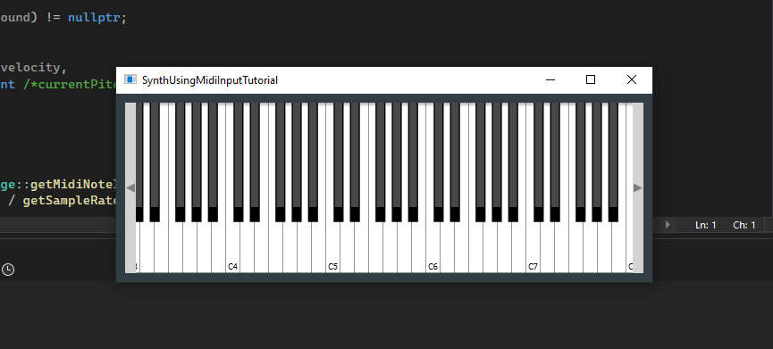

The [Build a Midi Synthesizer](https://juce.com/tutorials/tutorial_synth_using_midi_input/) project builds a JUCE application which displays a `SynthUsingMidiInputTutorial` window. This window consists of an on-screen keyboard that can be used to play a simple sine wave synthesiser.



# The `MainContentComponent` class
This is a subclass of `juce::AudioAppComponent` and `juce::Timer`.
* Generally, when we declare a class as a child of  `juce::Timer`, we wish to be able to use its `timerCallback` method, which will be repeatedly called at a given interval. The `juce::Timer` object itself will do nothing until the `startTimer` method is called, which will cause the message thread to start calling `timerCallback` at the specified interval (in this case, `400`, as written in the `MainContentComponent` constructor), until `stopTimer` is called or the object is deleted.
* The `juce::AudioAppComponent` inherits methods from both the `juce::Component` and `juce:.AudioSource` classes. One would only need to implement its `getNextAudioBlock` method; however, in here we also override the `resized` method (from the `Component` class) and `prepareToPlay` and `releaseResources` from the `juce::AudioAppComponent` . Note the `juce::AudioAppComponent`  class also comes with a `juce::AudioDeviceManager` instance called `deviceManager`.

The `MainContentComponent` class contains a `juce::ComboBox` (`midiInputList`) and a `juce::Label` object (`midiInputListLabel`) which are used to select the MIDI input device and to label such component on the GUI, respectively.

It also contains a `juce::MidiKeyboardComponent` object (`keyboardComponent`), which uses to display the keyboard on the screen and collect input events; a `juce::MidiKeyboardState` instance (`keyboardState`), which uses to keep track of the current state of the input MIDI device (i.e., which notes are being pressed, which not, etc.); and a `SynthAudioSource` instance called `synthAudioSource`, which uses to play sounds according to the keyboard state.

## Selecting the MIDI input
During construction of the `MainContentComponent` instance, its `keyboardComponent` gets setup to a `horizontalKeyboard` type. It then is displayed on the screen. Similarly, the 
`midiInputListLabel` and `midiInputList` are made visible on the screen. When the user selects a MIDI input device from this drop-down menu, `setMidiInput` method gets triggered. All that this method does it to setup the `synthAudioSource`'s `midiCollector` instance as the listener to the newly selected MIDI input device:

The `AudioDeviceManager::addMidiInputDeviceCallback` assigns a listener to the MIDI events arriving from the MIDI input device. The `SynthAudioSource` class contains an instance of a `juce::MidiMessageCollector` class, called `midiCollector`. The `juce::MidiMessageCollector` class is itself a subclass of `juce::MidiKeyboardState::Listener` and of `juce::MidiInputCallback`, so it can be used as listener for MIDI events. Effectively, thus, when selecting a MIDI input device on the screen, the code immediately connects that MIDI device to the `synthAudioSource`, so that this can listen to the events and act accordingly.

Now, to assign the selected MIDI input device to the `synthAudioSource`, we first remove the link between `synthAudioSource` and the previous selected device (using the complementary `AudioDeviceManager::removeMidiInputDeviceCallback` method), and we also make sure that the MIDI input device is "enabled". Only when "enabled" through the `AudioDeviceManager::setMidiInputDeviceEnabled` method, the device will have its events forwarded on to the listeners.

## Playing a note on the keyboard
When the user selects an input MIDI device on the screen, thus, the `midiCollector` from the `synthAudioSource` is reset to listen to its events. When playing a note on the input device, the `getNextAudioBlock` method will be triggered. This will call the `SynthAudioSource::getNextAudioBlock`, which will translate the incoming MIDI messages into blocks suitable for processing by a block-based audio callback.

The `juce::Synthesizer::renderNextBlock` method takes a `MidiBuffer` parameter (`inputMidi`) which carries a set of midi events, that are parsed to note and controller events. These events are then used to trigger the `synth`'s voices accordingly. Any events which happened outside the time between `startSample` and `startSample + numSamples` will be ignored. The processed data will be added to the current contents of the provided `AudioBuffer` object (`outputAudio`). Therefore, what we do before calling `juce::Synthesizer::renderNextBlock` is calling `juce::AudioSourceChannelInfo::clearActiveBufferRegion` to clear the `bufferToFill`. Next, we create a `juce::MidiBuffer` to collect the events coming from `keyboardState`. We first clear it with `juce::MidiMessageCollector::removeNextBlockOfMessages`; then fill it with events by calling `juce::MidiKeyboardState::processNextMidiBuffer`. Finally, we call `juce::Synthesiser::renderNextBlock` with the gathered midi events and the `bufferToFill`.

# The `SineWaveSound` struct
This is a derived struct from `juce::SynthesiserSound`. 

# The `SineWaveVoice` struct
This is a derived struct from `juce::SynthesiserVoice`. While a voice plays a single sound at a time, a synthesiser holds an array of voices so that it can play polyphonically. It therefore contains methods to play a note: `startNote` and `stopNote`, which together define how the note starts and finishes, and then `renderNextBlock`, which defines how the note develops through time (its shape).

## The `renderNextBlock` method
We loop over `numSamples`. Each `currentSample` is assigned a value:
```
sin(currentAngle) * level * tailOff
```
* `currentAngle` is different for every sample, starting with `0.0` for the first sample and incrementing `angleDelta` every other sample. This is basically just drawing the sinusoidal shape over all the samples.
* `level` is determined by the velocity with which one pressed the note on the keyboard. Higher the velocity, higher the gain or amplitude assigned to the `sin` function;
* `tailOff` is the factor that lowers down the gain or amplitude assigned to each sample. In this case, every next sample's gain is reduced by 1% from the previous sample. This causes a linear tail on the played note, which goes from the maximum amplitude `level` to something close to zero.

Then we add `currentSample` to the `outputBuffer`. Sometimes, `allowTailOff` is disabled and the `tailOff` factor is removed from the above equation.


# The `SynthAudioSource` class
This is a derived class from `juce::AudioSource`. It contains three member variables:
* a `juce::MidiMessageCollector` instance called `midiCollector`, which collects events happening on the on-screen keyboard;
* a `juce::MidiKeyboardState` instance called `keyboardState`, which keeps track of the current chords or notes being played on the on-screen keyboard;
* a `juce::Synthesiser` instance called `synth`, which is there to generate sound when a note is played on the keyboard.


Each synthesizer may be able to pay different sounds. For each `juce::SynthesiserSound` available one needs a `juce::SynthesiserVoice` subclass to play that sound. 

