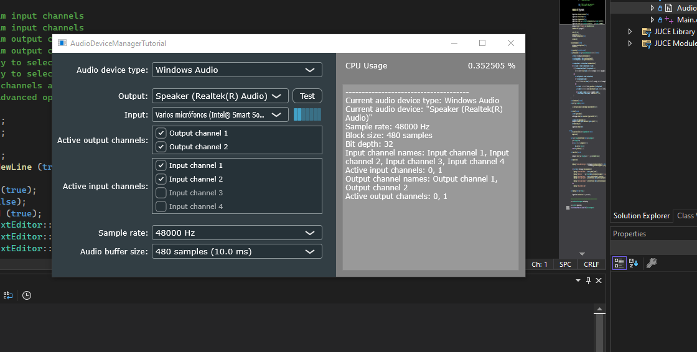

The [The AudioDeviceManager class](https://juce.com/tutorials/tutorial_audio_device_manager/) project builds a JUCE application which displays a `AudioDeviceManagerTutorial` window. This window consists of three blocks:
* the `audioSetupComp`, on the left, where all the audio setup menus such as "Audio device type" or "Sample rate" are found;
* the `diagnosticsBox`, on the right, where the current selected setup is displayed, together with other data;
* the `cpuUsageLabel` and `cpuUsageText`, which are used to display the current CPU usage.

# The `MainContentComponent` class
This is a class derived from the
* `juce::AudioAppComponent`, from which inherits `juce::Component` and `juce::AudioSource` capabilities, to allow streaming from audio devices. As such, one needs to implement in their derived class the `prepareToPlay`, `releaseResources` and `getNextAudioBlock` methods.
* `juce::ChangeListener`, which allows to receive event callbacks from a `ChangeBroadcaster`. Note a `ChangeBroadcaster` keeps a set of listeners to which it broadcasts a message when the `ChangeBroadcaster::sendChangeMessage` method is called. Meanwhile, a subclass of `ChangeListener` is required to receive these callbacks. As a derived class of `juce::ChangeListener`, we will need to implement the `changeListenerCallback` method.
* `juce::Timer`, which allows to repeatedly call the implemented `timerCallback` method at a given interval. When you create a `juce::Timer` object, it will do nothing until the `startTimer` method is called, which will cause the message thread to start making callbacks at the specified interval, until `stopTimer` is called or the object is deleted.

The `AudioAppComponent` contains an `AudioDeviceManager` instance called `deviceManager`.  The `AudioDeviceManager` is itself a derived class from the `juce::ChangeBroadcaster` class. During construction of the `MainContentComponent` instance, the current `MainContentComponent` instance gets assigned as a `juce::ChangeListener` to the `deviceManager`. Only when the `MainContentComponent` instance gets destroyed, the `MainContentComponent` instance gets also removed as `juce::ChangeListener` of the `deviceManager`.

When the `deviceManager` detects a change, it broadcasts this to the `MainContentComponent`, immediately trigerring its `changeListenerCallback`. This method is implemented so that to call the `dumpDeviceInfo` method, which only purpose is to collect the diagnostics data and call `logMessage` to print it onto the `diagnosticsBox`.

The change on the `deviceManager` happens through the `audioSetupComp`. This is an instance of the `juce::AudioDeviceSelectorComponent` class. The class build a component containing controls to let the user change the audio settings of the `AudioDeviceManager` object.

Finally, everytime the audio playback hardware (or whatever other destination the audio data is going to) needs another block of data, the `getNextAudioBlock` method is called. This method takes a reference to a `bufferToFill`. From the `deviceManager` we obtain the selected input audio `device`, and from that `device`, we gather the active input and output channels, as well as the maximum number of input and output channels. Then we loop over from 0 to the maximum number of output channels:
* if there is no active output channel at the specific index, then we clear the `buffer` for that channel; else
* if there is no active input channel at that index, then we clear the `buffer` for that channel; 
* otherwise, we take the `outBuffer` and `inBuffer` from `bufferToFill` and copy each sample from `inBuffer` into `outBuffer` scaling it down and adding some random factor to it.