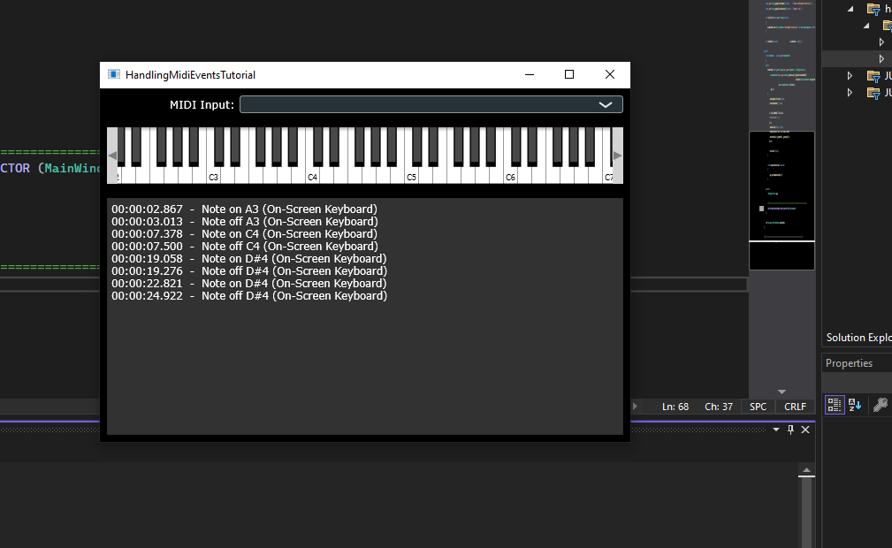
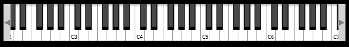
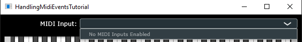
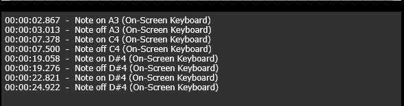

The [Handling MIDI events](https://juce.com/tutorials/tutorial_handling_midi_events/) project consists on building a JUCE application consisting of a window with three parts:
* a drop-down menu where to select the MIDI input device;
* an on-screen keyboard that the user can play with in case of not having or not wanting to use her/his own MIDI device; and
* a terminal-looking window priting when a keynote is being pressed, when it stopped being pressed; the times of these events, and the MIDI device that has been used in the process.


# A word about the `main.cpp` file
I am going to barely touch the `main.cpp` file, as this simply sets up the framework to build the JUCE application. It uses the macro `START_JUCE_APPLICATION` to start the JUCE app. The JUCE app is a `juce::JUCEApplicationBase` or `juce::JUCEApplication`-derived class.  The `Application` class is a derived type from `juce::JUCEApplication` and needs to implement the various pure virtual methods from  `juce::JUCEApplicationBase` in order for the application to work correctly. The header and implementation files for both classes are found at 
* For `JUCEApplication`: `<some-path>\JUCE\modules\juce_gui_basics\application\juce_Application.h` and `<some-path>\JUCE\modules\juce_gui_basics\application\juce_Application.cpp`; and
* for `JUCEApplicationBase`: `<some-path>\JUCE\modules\juce_events\messages\juce_ApplicationBase.h` and `<some-path>\JUCE\modules\juce_events\messages\juce_ApplicationBase.cpp`.

When designing your JUCEApp from `JUCEApplication`, one only needs to implement the constructor (and destructor), the `initialise` and `shutdown` methods, and obviously override the `getApplicationName` and `getApplicationVersion` to match your specific app. An example from [documentation](https://docs.juce.com/master/classJUCEApplication.html) is:
```
class MyJUCEApp  : public JUCEApplication
{
public:
    MyJUCEApp()  {}
    ~MyJUCEApp() {}
 
    void initialise (const String& commandLine) override
    {
        myMainWindow.reset (new MyApplicationWindow());
        myMainWindow->setBounds (100, 100, 400, 500);
        myMainWindow->setVisible (true);
    }
 
    void shutdown() override
    {
        myMainWindow = nullptr;
    }
 
    const String getApplicationName() override
    {
        return "Super JUCE-o-matic";
    }
 
    const String getApplicationVersion() override
    {
        return "1.0";
    }
 
private:
    std::unique_ptr<MyApplicationWindow> myMainWindow;
};
 
// this generates boilerplate code to launch our app class:
START_JUCE_APPLICATION (MyJUCEApp)
```
In our `Application` class in `main.cpp` file we therefore see the implementation of the `getApplicationName`, `getApplicationVersion`, `initialise` and `shutdown` functions, as well as the declaration of a unique pointer to a `MainWindow` instance, called `mainWindow`.

The `MainWindow` class is a class defined within the `Application` context.  It is a `DocumentWindow`-derived class which further contains a `JUCEApplication` instance called `app`. 

The constructor takes:
* a `name`, which is passed onto the `DocumentWindow` constructor to be used as the title of the resizable window;
* a pointer to a `juce::Component`, `c`, which is used to set the content of the `DocumentWindow` we've just constructed;  and
* a reference to the `JUCEApplicationBase`-derived instance that initialises `app` to, and which allows to quit the application when the user presses the close button on `mainWindow`.

When calling `Application::initialise`, the `mainWindow` pointer is set to point to a new instance of `MainWindow` with:
* title "HandlingMidiEventsTutorial", 
* which points to a new instance of `MainContentComponent`, defined in `HandlingMidiEventsTutorial.h`, and  
* which takes a reference to the current `Application` instance.

# The `MainContentComponent` class in `HandlingMidiEventsTutorial.h`
This is a derived class from the
* `juce::Component` class. This is the ["base class for all JUCE user-interface objects"](https://docs.juce.com/master/classComponent.html)(as such, we see implemented its `paint` and `resized` methods);
* `juce::MidiInputCallBack` class, which allows to ["receive incoming messages from a physical MIDI input device"](https://docs.juce.com/master/classMidiInputCallback.html#details) (as such, we see implemented its `handleIncomingMidiMessage` method); and 
* `juce::MidiKeyboardStateListener` class, which detects or listens to events coming from  the MIDI keyboard (i.e., keys currently pressed). As such, we see implemented its `handleNoteOn` and `handleNoteOff` methods. In JUCE, the MIDI keyboard is represented by the [`MidiKeyboardState` class](https://docs.juce.com/master/classMidiKeyboardState.html#details).

The `MainContentComponent` class contains elements for:
* the drop-down menu. This is expressed on the GUI through a `juce::ComboBox` object, which shows the list of MIDI inputs `midiInputListLabel` detected from the `deviceManager`, as well as any changes on the selected MIDI input device.
* the keyboard. This is encapsulated in the two objects: the `keyboardComponent` and the `keyboardState`.
* the logging page, which is expressed on the GUI throug a `juce::TextEditor` instanced called `midiMessagesBox`. The display of the logging GUI is set during construction of the `MainContentComponent`.  

## The on-screen keyboard
The keyboard that you can see on the screen gets build and managed through the following two objects:
- the `keyboardComponent`, which is a `juce::MidiKeyboardComponent` instance which is responsible for the display of the piano keyboard; and
- the `keyboardState`, which is a `juce::MidiKeyboardState` instance, which keeps track of the current state of the piano keyboard (i.e., which keys are being pressed).



During the construction of `MainContentComponent`, the `keyboardComponent` is added to be displayed on the GUI, and `keyboardState` is set to listen to midi messages from the current `MainContentComponent`.

## The drop-down menu
The drop-down menu in the GUI consists of two things:
* the `juce::Label` instance called `midiInputListLabel`, which basically displays the "MIDI input" text that you can see on the window;
* the `juce::ComboBox` instance called `midiInputList`, which basically displays the drop-down menu of available MIDI devices.



During the construction of `MainContentComponent`, the `midiInputListLabel` is attached to to the `juce::ComboBox` (`midiInputList`) component. Then, the names of each of the MIDI input devices detected through `juce::MidiInput::getAvailableDevices` gets added to the `juce::ComboBox` instance (`midiInputList`).

The `juce::ComboBox::onChange` function method gets initialised to some lambda function which essentially calls `setMidiInput` everytime `midiInputList` detects a change on the selected item of the MIDI device list. 

At the same time, by default, `MainContentComponent` will listen to the events from the first item on the `midiInputLis`. If this gets changed by the user, this is then handled by `juce::ComboBox::onChange`.

## The logging page
The logging page prints out every event in which a keynote was pressed or stopped being pressed. In the message it prints:
* the time of the event;
* the type of the event (note on/off);
* the keynote affected; and
* the input device (the on-screen keyboard or name of the selected MIDI device).



The GUI for the logging page gets setup during the construction of the `MainContentComponent` instance.

(a) When an event happens in one of the plugged-in MIDI devices, then the `handleIncomingMidiMessage` method (derived from the `juce::MidiInputCallBack` class) gets called. It sets `isAddingFromMidiInput` to true temporarily so that when `handleNoteOn` and `handleNoteOff` are called, nothing is done. (b) When the event happens on the keyboard on the screen, the source is no longer an external MIDI device, so `handleIncomingMidiMessage` is not called and instead we move on straight to either `handleNoteOn` or `handleNoteOff` methods (derived from the `juce::MidiKeyboardStateListener` class). The `juce::MidiKeyboardStateListener` class detects a change on the `keyboardState` (note on/off) and calls one of each of the methods accordingly. 

In any case, all `handleIncomingMidiMessage`, `handleNoteOn` or `handleNoteOff` will build a message and pass this onto `postMessageToList`, together with a string specifying the "source" (on-screen keyboard or some input MIDI keyboard). 

### `postMessageToList`
This method creates a new `IncomingMessageCallback` instance with the input message and source, and immediately calls its internal `post` method. `messageCallback` is triggered once `post` is done dispatching the message. The `messageCallback` method has been implemented so that to call `MainContentComponent::addMessageToList`, which simply reformats the input `message` and wraps it inside a `juce::String` which is then passed onto `logMessage`. Finally, `logMessage` takes the input message on `juce::String` format and inserts it at the caret position. **Note**: The `juce::TextEditor` class contains some methods which talk about a "caret". The "caret" on the `juce::TextEditor` class is used as a marker where the text editor is meant to write new text. It is the same as the pulsing vertical line that you see when you type on your computer. 


