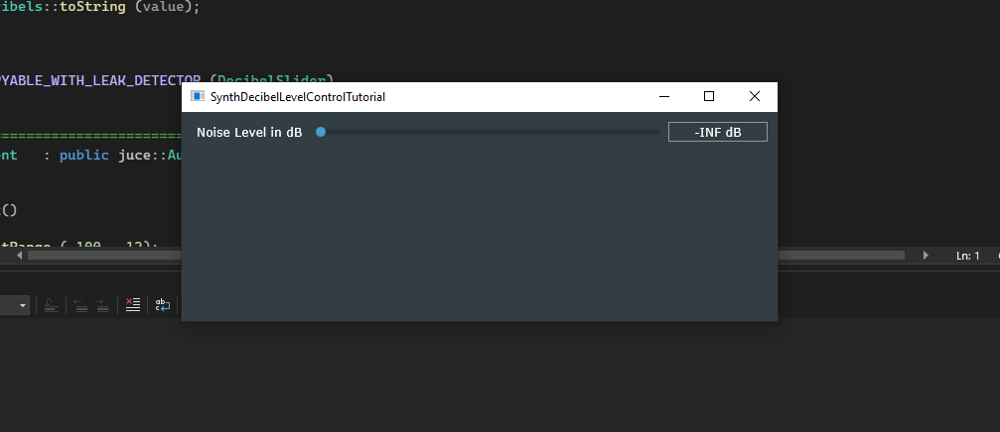

The [Control audio levels using decibels](https://juce.com/tutorials/tutorial_synth_db_level_control/) project builds a JUCE application which displays a `SynthDecibelLevelControlTutorial` window. This window consists of a level slider which allows to set the gain in decibels for white noise.

# The `DecibelSlider` class
This is a class derived from `juce::Slider` which implements two of its parent's functions:
* `getValueFromText`, which takes a reference to a `juce::String` called `text`. We trim `text` up to the first occurrence of the characters "dB"; then, if the remaining text equals "-INF", we set the decibel value to be `minusInfinitydB = -100.0`; otherwise, the decibel value is set to be the conversion to `double` value of the remaining text. The method is used for when the user enters something into the text-entry box, to convert it to a value.
* `getTextFromValue`, which takes a `double`, representing the noise level in decibels, and simply translated that `double` value into text. This method is used for when the user sets the decibel value on the slider, to convert it into text.

# The `MainContentComponent` class
This is a class derived from `juce::AudioAppComponent`, which itself is a derived class from `juce::Component` and `juce::AudioSource`. From the former we shall see implemented the `resized` method, as for the latter we shall see implemented the `prepareToPlay` and `releaseResources` methods, as well as the `getNextAudioBlock` method.  

While `prepareToPlay` is used to set the `AudioSource` to `prepared` state before any calls are made to `getNextAudioBlock`,  `releaseResources` is used to set the `AudioSource` to `unprepared` state, once playback is finished.

`getNextAudioBlock` takes a reference to a `juce::AudioSourceChannelInfo` object called `bufferToFill`. A `juce::AudioSourceChannelInfo` object is a struct used to wrap an `AudioBuffer` object called `buffer`, further allowing to call the `clearActiveBufferRegion` to conveniently clear the `buffer` in case the source is not producing any data; as well as accessing the first sample, `startSample`, as well as the total number of samples, `numSamples`,  that the buffer is expected to fill in with data. Note that the `AudioBuffer` is essentially an array of channels, each of which consisting of an array of float-value samples.

During `getNextAudioBlock`, we loop over each channel in `buffer.getNumChannels`, and for each channel, we loop over its `buffer.numSamples`. Each sample in the buffer is set to `(2.0 * random.nextFloat() - 1) * currentLevel`. Note that `random.nextFloat()` returns a random number between 0. and 1.0.

